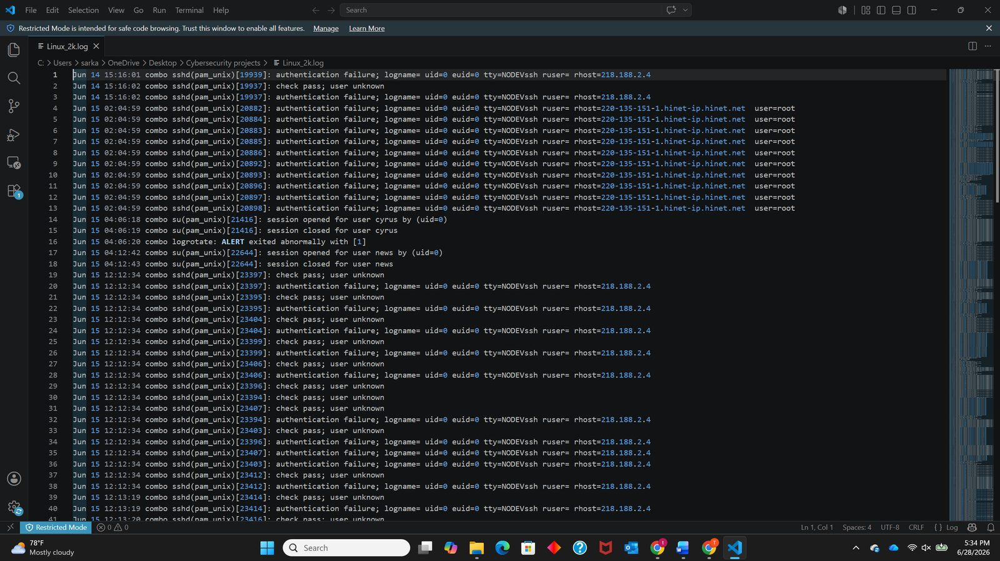
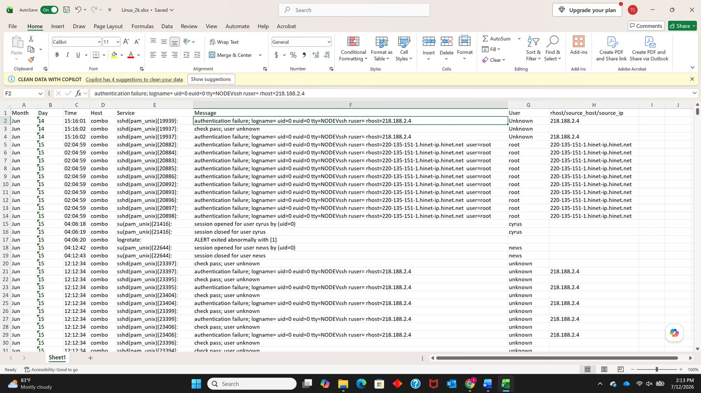
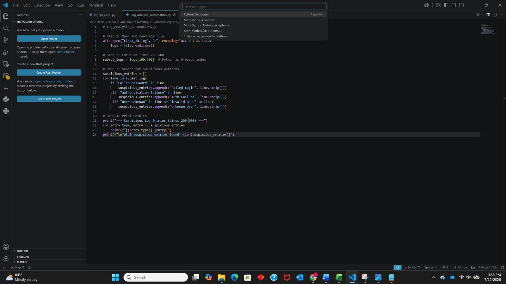
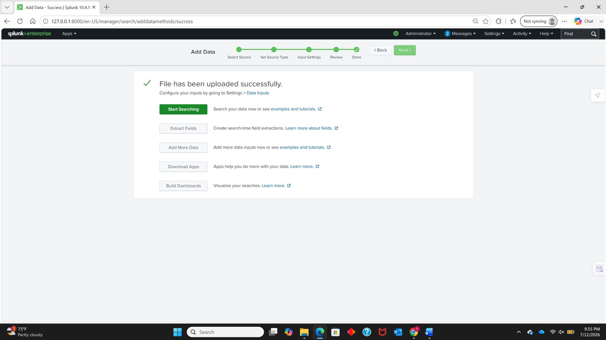
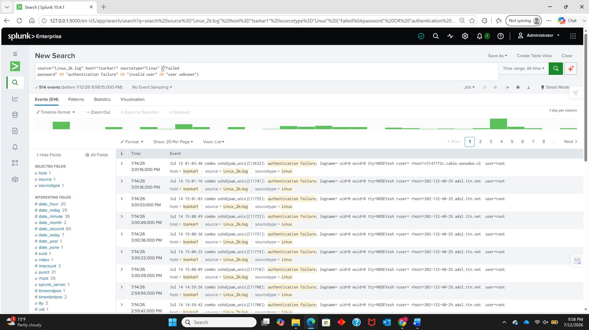
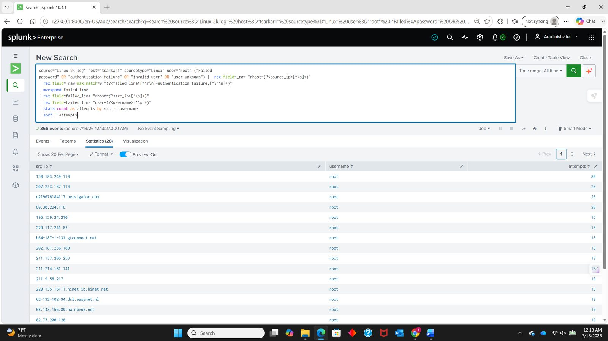
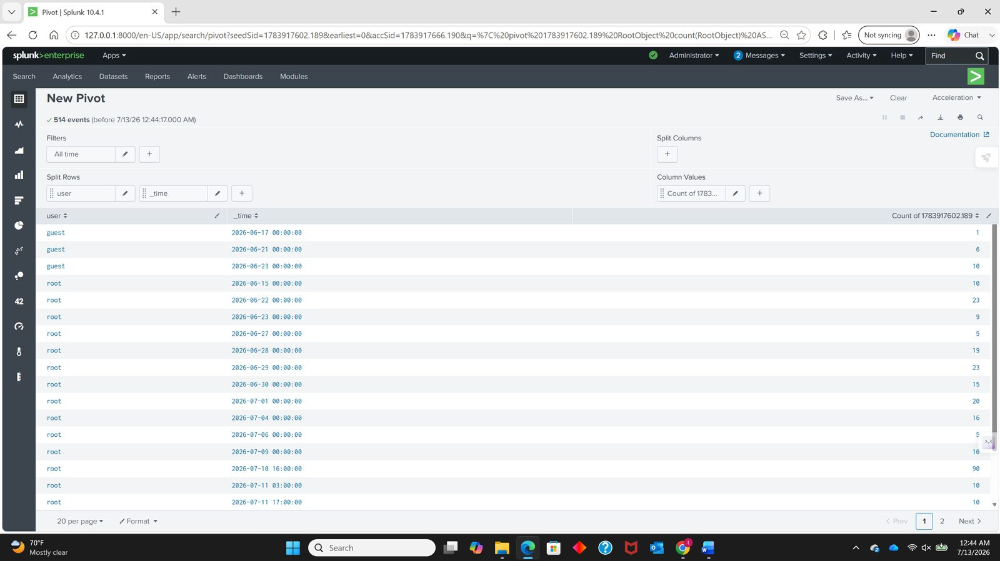
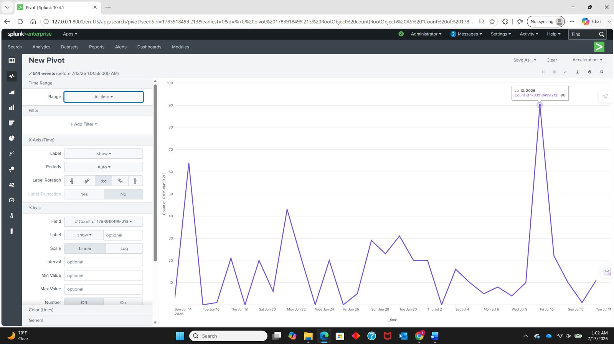

# Linux Log File Analysis, Automation, and SIEM Visualization

A hands-on SOC-focused lab: manually triaging Linux authentication logs, automating detection with Python, and ingesting, querying, and visualising the same dataset in Splunk Enterprise.


---

## Objective

Build the core workflow of a Tier 1 SOC analyst — **monitor → detect → analyse** — across three levels of tooling maturity, using a single real-world Linux authentication log.

The lab begins with manual review in a text editor and a spreadsheet, progresses to a Python script that classifies suspicious events automatically and exports them to CSV, and finishes by ingesting the same file into Splunk Enterprise to query, correlate, and visualise the activity at scale. The intent is to demonstrate not only that each tool works, but **why an analyst moves from one to the next** as data volume grows beyond what manual review can cover.

---

## Key Findings

| Metric | Value |
|---|---|
| Log lines analysed | 2,000 |
| **Suspicious entries identified** | **607 (30.4% of the file)** |
| — Authentication failures | 490 |
| — Unknown-user probes | 117 |
| — `Failed password` matches | **0** — see [Secondary Finding](#secondary-finding-a-detection-rule-that-matched-nothing) |
| Distinct attacking sources | 47 |
| Attempts against `root` | 351 of 372 named-user attempts (**94.4%**) |
| Other accounts targeted | `guest` (17), `test` (4) |
| Observation window | 41 days (14 June – 26 July) |
| Busiest single source | `150.183.249.110` — 80 attempts in **95 seconds** |
| Fastest observed rate | `220.117.241.87` — 13 attempts in 13 seconds (60/min) |
| Events indexed in Splunk | 1,296 |
| Events matching the detection filter | 514 |

---

## Lab Environment

| Component | Name | Configuration |
|---|---|---|
| Dataset | `Linux_2k.log` | LogHub Linux authentication log — 2,000 lines, 14 June to 27 July |
| Monitored host | `combo` | Linux server producing the sshd, ftpd, su, and logrotate events |
| Manual analysis | Microsoft Excel | `Linux_2k.xlsx` — 2,000 lines parsed into 8 structured columns |
| Automation | Python 3.x / VS Code | `Log_Analysis_Automation.py`, `log_to_excel.py` |
| SIEM | Splunk Enterprise 10.4.1 | Local single-instance install, web UI at `127.0.0.1:8000` |
| Splunk input | `source="Linux_2k.log" host="tsarkar1" sourcetype="Linux"` | 1,296 events indexed |

---

## Objective 1 — Manual Log Analysis

Reading a real Linux authentication log by eye, recognising what suspicious activity looks like in raw syslog format, and organising findings into a structure that can be filtered and counted. Every automated technique used later exists to scale what is done manually here.

Analysis was limited to the first 20–40 lines — the same approach an analyst takes when triaging an unfamiliar log source, establishing what *normal* looks like before hunting for anomalies.



**Within the first 40 lines alone:** 23 authentication failures, 12 unknown-user probes, one abnormal service exit (`logrotate: ALERT exited abnormally with [1]`), and two legitimate session openings for comparison. Two sources accounted for all failures — `218.188.2.4` (13 attempts) and `220-135-151-1.hinet-ip.hinet.net` (10).

Reading lines in an editor establishes the pattern but cannot answer *which source is most active* or *which account is most targeted*. The full log was parsed into structured columns with [`log_to_excel.py`](scripts/log_to_excel.py):



---

## Objective 2 — Automating Log Analysis

Manual review works for 40 lines and becomes unreliable well before 2,000. This stage replaces the eye with a script that reads the log, classifies every line against a set of detection patterns, and writes the results to CSV.

```python
# Detection patterns, ordered most specific first
PATTERNS = [
    ("Failed Login", ("Failed password",)),
    ("Auth Failure", ("authentication failure",)),
    ("Unknown User", ("user unknown", "invalid user")),
]

for line in subset_logs:
    event_type = classify(line)
    if event_type:
        findings.append((event_type, line.strip()))
```

Run it:

```bash
python scripts/Log_Analysis_Automation.py --log data/Linux_2k.log
python scripts/Log_Analysis_Automation.py --log data/Linux_2k.log --start 199 --end 500
```

```
Lines in file      : 2000
Lines scanned      : 2000
Suspicious entries : 607
  Failed Login  : 0
  Auth Failure  : 490
  Unknown User  : 117
```



Output: [`Full_suspicious_logs.csv`](output/Full_suspicious_logs.csv) (607 entries, full file) and [`suspicious_logs.csv`](output/suspicious_logs.csv) (140 entries, lines 200–500).

---

## Objective 3 — Log Analysis and Visualization with Splunk

A Python script answers questions it was written to answer. A SIEM answers questions asked *after* the data is loaded.

The same `Linux_2k.log` was ingested into Splunk Enterprise via **Settings → Add Data → Upload**, with the source type saved as `Linux` and the host set to a constant value.



### Detection filter

```spl
source="Linux_2k.log" host="tsarkar1" sourcetype="Linux"
("Failed password" OR "authentication failure" OR "invalid user" OR "user unknown")
```

This narrowed **1,296 events → 514**, every one matching a known indicator of brute-force or unauthorised access.



### Field extraction in SPL

Keyword filtering finds the events; extracting fields makes them *countable*:

```spl
| rex field=_raw max_match=0 "(?<failed_line>[^\r\n]*(?:Failed password|authentication failure|invalid user|user unknown)[^\r\n]*)"
| mvexpand failed_line
| eval authentication_type=case(
    like(failed_line,"%Failed password%"),"Failed password",
    like(failed_line,"%authentication failure%"),"Authentication failure",
    like(failed_line,"%invalid user%"),"Invalid user",
    like(failed_line,"%user unknown%"),"User unknown"
  )
| stats count as attempts by authentication_type
| sort - attempts
```



All searches used are in [`splunk/queries.spl`](splunk/queries.spl).

### From records to behaviour

Splunk presents the same result set through four views, each answering a different question. Working through them in order is the practical shape of an investigation: **find it → confirm it repeats → measure it → show it.**

| View | Question it answers | What it showed |
|---|---|---|
| **Events** | What individual records exist? | Repeated failures against `root` from a single source, seconds apart |
| **Patterns** | Does this repeat systematically? | One cluster — SSH auth failure against root — dominates the sample |
| **Statistics** | How much, by whom, when? | 90 events against `root` in a single hour on 10 July |
| **Visualization** | What is the shape over time? | Low baseline punctuated by sharp, isolated spikes |





This is the value a SIEM adds over the previous two stages. The Python script could count 607 suspicious entries; it could not show that they arrive in **concentrated bursts separated by weeks of quiet** — and that shape is what distinguishes an automated campaign from background noise.

---

## Incident Analysis

> The three objectives above followed the project brief. This section does not — it treats the dataset as an actual incident to be scoped, quantified, and explained.

### Top attacking sources

Forty-seven distinct sources generated the 607 suspicious entries, but the distribution is heavily skewed:

| Source | Attempts | Target | Burst window | Rate |
|---|---:|---|---|---|
| `150.183.249.110` | 80 | root | 10 Jul 16:01:43 – 16:03:18 (95s) | **50.5/min** |
| `n219076184117.netvigator.com` | 23 | root | 22 Jun 03:17:26 – 03:18:22 (56s) | 24.6/min |
| `207.243.167.114` | 23 | root | 26 Jul 07:02:27 – 07:04:12 (105s) | 13.1/min |
| `60.30.224.116` | 20 | root | 30 Jun (dispersed) | low and slow |
| `195.129.24.210` | 15 | root | 30 Jun – 1 Jul (dispersed) | low and slow |
| `218.188.2.4` | 14 | (unknown user) | 14 – 15 Jun (dispersed) | low and slow |
| `h64-187-1-131.gtconnect.net` | 13 | root | 29 Jun 12:11:53 – 12:12:10 (17s) | 45.9/min |
| `220.117.241.87` | 13 | root | 04 Jul 19:15:48 – 19:16:01 (13s) | **60.0/min** |
| `220-135-151-1.hinet-ip.hinet.net` | 10 | root | 15 Jun 02:04:59 (single second) | burst |
| `p15105218.pureserver.info` | 10 | root | 09 Jul 19:34:06 – 19:34:14 (8s) | 75.0/min |

### Two distinct attack behaviours

**Concentrated bursts.** `150.183.249.110` produced 80 authentication failures against `root` in 95 seconds — roughly one attempt every 1.2 seconds — then never appeared again. No human types at that rate; this is tooling working through a credential list.

**Low-and-slow probing.** Sources such as `60.30.224.116` and `195.129.24.210` spread a comparable number of attempts across many hours. That pacing is a deliberate evasion technique — it stays beneath the per-minute thresholds that simple rate-based alerting relies on, **which is precisely why detection built purely on "N failures in M minutes" misses it.**

Both classes target the same account: 351 of 372 named-user attempts went after `root`.

### Root cause

The host was running SSH reachable from the public internet with password authentication enabled and no evident rate limiting. Many unrelated sources arriving independently over a 41-day window is the signature of **internet-wide scanning** — automated tools enumerating reachable SSH endpoints and trying common credentials against whatever they find. The `check pass; user unknown` messages confirm usernames were being guessed too, so the attackers had no prior knowledge of valid accounts.

### Remediation

| Control | Effect |
|---|---|
| Disable SSH password authentication; require keys | Removes the attack class entirely |
| `PermitRootLogin no` | Invalidates **94.4%** of observed attempts in one config change |
| Restrict SSH to known networks (firewall / VPN / bastion) | Removes the host from the scanned population |
| Deploy `fail2ban` or equivalent | Blocks source addresses automatically after N failures |
| Alert on failure **rate**, not individual events | One failure is routine; 80 in 95 seconds is an incident |
| Investigate the 43 `logrotate` abnormal exits | A failing log-rotation service threatens the evidence itself |

### Secondary Finding: a detection rule that matched nothing

The detection logic tests for three patterns. One of them — **`Failed password` — matched zero events across all 2,000 lines.** The same string was included in the Splunk filter and contributed nothing there either.

This is not a coding error. It is a **log-format mismatch**:

| Format | Message written |
|---|---|
| OpenSSH direct | `Failed password for root from 10.0.0.1 port 22 ssh2` |
| PAM stack (this host) | `authentication failure; logname= uid=0 ... user=root` |

Both describe the same event; only the wording differs. A rule written against one format silently returns nothing against the other.

Had this dataset contained only PAM-formatted events and the rule set only the `Failed password` pattern, the detection would have reported a clean result while **490 authentication failures passed through unnoticed** — a false negative produced by a rule that appeared to be working correctly.

The lesson generalises well beyond this lab: **a detection rule that fires on nothing is indistinguishable, from the outside, from a quiet environment.** Coverage has to be validated against the log format actually in use, not assumed from the rule's wording.

---

## Repository Structure

```
linux-log-analysis-siem/
├── README.md
├── docs/
│   └── Linux_Log_Analysis_Report.pdf    # PDF export for in-browser preview
├── scripts/
│   ├── Log_Analysis_Automation.py       # detection + CSV export
│   └── log_to_excel.py                  # syslog → structured columns
├── splunk/
│   └── queries.spl                      # all SPL searches used
├── data/
│   └── Linux_2k.log                     # source dataset (LogHub)
├── output/
│   ├── Full_suspicious_logs.csv         # 607 flagged entries
│   ├── suspicious_logs.csv              # 140 flagged entries (lines 200–500)
│   └── Linux_2k.xlsx                    # structured spreadsheet
└── screenshots/                         # 36 evidence images
```

---

## Skills Demonstrated

- **Log analysis** — reading and interpreting raw Linux authentication logs in syslog format
- **Data structuring** — parsing 2,000 free-text lines into typed, filterable columns
- **Detection engineering** — writing and, more importantly, *validating* keyword-based detection rules
- **Python automation** — turning a manual triage task into a repeatable script with CSV output
- **SIEM operations** — ingesting, indexing, and configuring source types and inputs in Splunk Enterprise
- **SPL** — `rex`, `mvexpand`, `eval case()`, `stats`, `timechart`, `bucket` for field extraction and aggregation
- **Incident scoping** — quantifying an attack by rate, duration, source distribution, and target concentration
- **Analytical writing** — documenting findings, root cause, and remediation in SOC report format

---

## Dataset Attribution

`Linux_2k.log` is from the [LogHub](https://github.com/logpai/loghub) collection of real-world log datasets, published for log-analysis and anomaly-detection research. The source addresses in this report are those recorded in that public dataset and are reproduced as analytical evidence.

---

## Author

**Tanmay Sarkar** — SOC analyst lab project
